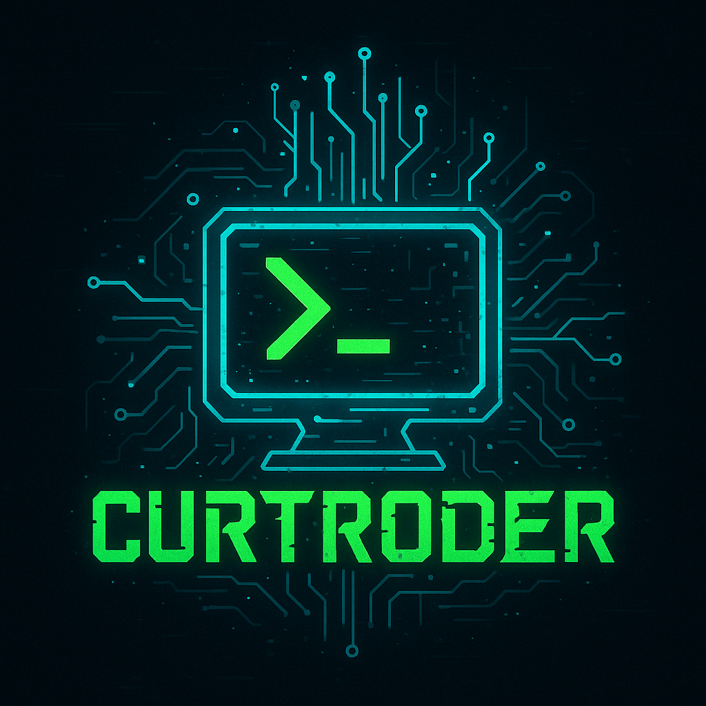

# ⚡ Curtroder - A Futuristic Termux Theme by Current Vai ♚

Welcome to **Curtroder** – a sleek, hacker-style theme for your Termux terminal that transforms your shell into a **cyberpunk-inspired interface**.  
With dynamic visuals, persistent headers, and personalized banners, Curtroder makes your terminal not just useful—but **awesome**.

---
<p align="center">
  
</p>

# Curtroder
A futuristic Termux intro + banner tool by Current Vai ♚  <!-- এখানে একটি স্ক্রিনশটের লিঙ্ক দেবেন -->

---

## 🚀 Features

✨ **Dynamic Loading Animation**  
  Get a cool hacker-style animated intro every time you launch Termux.

✨ **Personalized ASCII Banner**  
  Generates a custom banner with your name during installation.

✨ **Pinned Header**  
  Your banner and info remain visible even after using the `clear` command.

✨ **Live System Info**  
  Displays **Date**, **Time**, and your **Public IP Address** at the top.

✨ **Customized Prompt**  
  A colorful and informative command prompt to improve CLI readability.

---

## 🧪 Preview

```
┌────────────────────────────┐
│    Welcome, Current Vai!   │
│   IP: 103.xxx.xxx.xx       │
│   Date: 20xx-xx-xx         │
└────────────────────────────┘
```

*(Preview your banner and prompt after install)*

---

## 📦 Installation

Just copy-paste these commands into your Termux terminal to get started:

# Update packages and install git
```bash
pkg update && pkg upgrade -y
pkg install git -y
```

# Clone the Curtroder repository
```bash
git clone https://github.com/currentvai/Curtroder.git
```

# Enter the directory and run the installer
```bash
cd Curtroder
bash Curtroder-install.sh
```

✅ After installation is complete, simply **restart your Termux** to see the changes.

---

## 🧹 Uninstallation

If you'd like to restore your previous Termux look:

# Restore your original .bashrc
```bash
mv ~/.bashrc.bak ~/.bashrc
```
# Restart Termux
```bash
exit
```
---
🔄 One-Click Update Command

To update the Curvidar tool to the latest version, just run the following command in Termux or Linux:

```bash
cd $HOME/Curtroder && git pull && chmod +x *.sh && echo "✅ Curtroder Update!"
```
---


Your original settings and prompt will be restored.

---

⚠️ **Disclaimer
This tool is intended for personal and educational use only.**

**Please respect the copyrights of content creators.**

❗ **The developer is not responsible for any misuse of this script.**

---


## 🛠️ Developer Info

**Developed with ❤️ by [Current Vai ♚](https://github.com/currentvai)**  
📬 Contact: [@CurrentVai on Telegram](https://t.me/currentVai)

---**© Copyright 2025 — All Rights Reserved.**

---

## 🌐 Connect

- 💬 Telegram: [@CurrentVai](https://t.me/currentVai)
- 🐙 GitHub: [Current7777](https://github.com/currentvai)

---

## 📢 License

This project is licensed under the **MIT License**.

If you want to give me any advice, feel free to contact me.👇👇👇

Telegram: [@CurrentVai](https://t.me/currentvai) 

